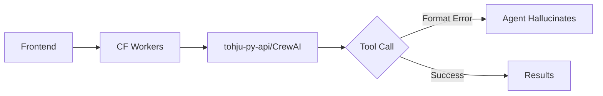
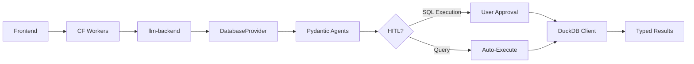

# DATABASE TOOLS MIGRATION: CrewAI → Pydantic AI + HITL

**Status:** 🚧 In Progress
**Created:** 2025-11-30
**Author:** Migration from tohju-py-api CrewAI to llm-backend Pydantic AI

---

## Table of Contents

1. [Overview](#overview)
2. [Architecture](#architecture)
3. [Components](#components)
4. [Implementation Guide](#implementation-guide)
5. [API Reference](#api-reference)
6. [Testing Strategy](#testing-strategy)
7. [Migration Checklist](#migration-checklist)

---

## Overview

### Problem Statement

The current CLIENT_DATABASE tool implementation in `tohju-py-api` uses CrewAI with string-based tool calling, leading to:

- ❌ **Format Errors:** Agent wraps inputs in arrays, includes expected results
- ❌ **Type Ambiguity:** No validation until runtime
- ❌ **Hallucination:** Agent makes up data when tools fail
- ❌ **Poor Error Handling:** Agent ignores error messages
- ❌ **Maintenance Burden:** Fighting agent interpretation instead of building features

### Solution

Migrate database operations to `llm-backend` using:

- ✅ **Pydantic AI:** Typed inputs/outputs, automatic validation
- ✅ **HITL System:** Human-in-the-loop SQL approvals
- ✅ **Type Safety:** Compile-time validation, no guessing
- ✅ **Better UX:** Clear error messages, reliable execution
- ✅ **Reusability:** Provider pattern for extensibility

---

## Architecture

### Current Flow (Broken)



### New Flow (Proposed)



### Routing Change

**File:** `cf-workers/core-api-d1kvr2/src/lib/AgentRoutingService.ts`

```typescript
// Line 191-196: BEFORE
else if (toolNames.includes(AgentTools.CLIENT_DATABASE)) {
  shouldSkipRag = true;
  useMiniLLM = true;
  targetApiUrl = `${env.EXTERNAL_LLM_API_URL}/api/agents/crew`;  // CrewAI
}

// AFTER
else if (toolNames.includes(AgentTools.CLIENT_DATABASE)) {
  shouldSkipRag = true;
  useMiniLLM = true;
  targetApiUrl = `${env.PY_LLM_API_URL}/api/database/run?enable_hitl=true`;  // Pydantic AI
}
```

**Environment Variables:**
- `EXTERNAL_LLM_API_URL` = `https://tohju-api.example.com` (tohju-py-api)
- `PY_LLM_API_URL` = `https://llm-backend.example.com` (llm-backend)

---

## Components

### 1. Database Provider

**File:** `src/llm_backend/providers/database_provider.py`

**Purpose:** Implements `AIProvider` interface for database operations

**Follows Pattern:** `replicate_provider.py`

**Key Methods:**
```python
class DatabaseProvider(AIProvider):
    def get_capabilities(self) -> dict:
        """Return supported operations: schema_inspection, query, execution"""

    def create_payload(self, user_input: str, form_data: dict) -> dict:
        """Parse user intent, create operation payload"""

    def validate_payload(self, payload: dict) -> ValidationResult:
        """Validate SQL syntax, detect operation type"""

    async def execute(self, payload: dict) -> ProviderResponse:
        """Route to appropriate Pydantic agent"""

    def audit_response(self, response: dict) -> AuditResult:
        """Audit query results for quality"""
```

**Capabilities Response:**
```json
{
  "operations": [
    {
      "name": "schema_inspection",
      "description": "View database schema, tables, columns",
      "requires_approval": false
    },
    {
      "name": "database_query",
      "description": "Execute SELECT queries (read-only)",
      "requires_approval": false
    },
    {
      "name": "sql_execution",
      "description": "Execute INSERT/UPDATE/DELETE/CREATE operations",
      "requires_approval": true
    }
  ]
}
```

---

### 2. Pydantic AI Agents

#### Schema Inspection Agent

**File:** `src/llm_backend/agents/database_schema_agent.py`

**Input Model:**
```python
from pydantic import BaseModel, Field

class SchemaInspectionInput(BaseModel):
    query: str = Field(
        description="Schema query: 'show tables', 'describe TABLE_NAME'"
    )
```

**Output Model:**
```python
class SchemaInspectionOutput(BaseModel):
    status: str  # "success" | "error"
    agentId: str
    tableCount: int
    tables: list[dict]  # [{"name": "customers", "rowCount": 5, "columns": [...]}]
    message: str
    error: str | None = None
```

**Agent Definition:**
```python
from pydantic_ai import Agent

schema_agent = Agent(
    "openai:gpt-4.1-mini",
    output_type=SchemaInspectionOutput,
    system_prompt="""You inspect client-side DuckDB database schemas.

Your job:
1. Parse schema inspection requests
2. Return structured table/column information
3. Include row counts for each table
4. Provide clear error messages

Operations:
- "show tables" → List all tables with row counts
- "describe {table}" → Show columns for specific table
- "tables" → Same as show tables

Example Output:
{
  "status": "success",
  "tableCount": 4,
  "tables": [
    {
      "name": "customers",
      "rowCount": 10,
      "columns": [
        {"name": "id", "type": "BIGINT", "pk": true},
        {"name": "name", "type": "VARCHAR", "pk": false}
      ]
    }
  ]
}"""
)
```

**Usage:**
```python
async def inspect_schema(query: str) -> SchemaInspectionOutput:
    result = await schema_agent.run(query)
    return result.output
```

---

#### Database Query Agent

**File:** `src/llm_backend/agents/database_query_agent.py`

**Input Model:**
```python
class QueryInput(BaseModel):
    sql_query: str = Field(
        pattern=r'^SELECT\s+.*',  # Must start with SELECT
        description="Read-only SELECT query"
    )
    description: str = Field(
        max_length=200,
        description="What you're querying for"
    )
```

**Output Model:**
```python
class QueryOutput(BaseModel):
    status: str  # "query_created" | "error"
    checkpoint_type: str = "DATABASE_QUERY"
    query: str
    description: str
    auto_execute: bool = True
    requires_approval: bool = False
    error: str | None = None
```

**Agent Definition:**
```python
query_agent = Agent(
    "openai:gpt-4.1-mini",
    output_type=QueryOutput,
    system_prompt="""You create read-only SELECT queries for client-side database.

Rules:
1. Only SELECT queries allowed
2. No INSERT/UPDATE/DELETE/DROP
3. Validate SQL syntax
4. Return structured checkpoint for frontend execution

Validation:
- Query must start with SELECT
- No semicolons allowed (prevents SQL injection)
- Balanced quotes and parentheses

Example:
Input: sql_query="SELECT * FROM invoices WHERE total > 100"
Output: {
  "status": "query_created",
  "checkpoint_type": "DATABASE_QUERY",
  "query": "SELECT * FROM invoices WHERE total > 100",
  "auto_execute": true
}"""
)
```

---

#### SQL Execution Agent

**File:** `src/llm_backend/agents/sql_execution_agent.py`

**Input Model:**
```python
class SQLExecutionInput(BaseModel):
    sql_commands: list[str] = Field(
        description="SQL statements to execute"
    )
    reasoning: str = Field(
        description="Why these SQL statements are needed"
    )
    entity_type: str = Field(
        description="Operation type: INSERT, CREATE_TABLE, UPDATE, DELETE"
    )
```

**Output Model:**
```python
class SQLExecutionOutput(BaseModel):
    status: str  # "checkpoint_created" | "error"
    checkpoint_type: str = "SQL_EXECUTION"
    sql_commands: list[str]
    reasoning: str
    entity_type: str
    validation_summary: dict  # {blocking_issues: 0, total_issues: 0}
    requires_approval: bool = True
    error: str | None = None
```

**Agent Definition:**
```python
execution_agent = Agent(
    "openai:gpt-4.1-mini",
    output_type=SQLExecutionOutput,
    system_prompt="""You validate and prepare SQL operations for HITL approval.

Your job:
1. Validate SQL syntax
2. Detect operation type (INSERT, CREATE_TABLE, etc.)
3. Provide clear reasoning for user review
4. Create checkpoint for approval

Operations Requiring Approval:
- INSERT INTO (adds data)
- CREATE TABLE (creates schema)
- UPDATE (modifies data)
- DELETE FROM (removes data)
- ALTER TABLE (changes schema)

Validation Checks:
- Syntax correctness
- Foreign key integrity
- Data type compatibility
- No SQL injection patterns

Example Output:
{
  "status": "checkpoint_created",
  "checkpoint_type": "SQL_EXECUTION",
  "sql_commands": [
    "INSERT INTO customers (id, name) VALUES (1, 'John')"
  ],
  "reasoning": "Inserting customer data from invoice PDF",
  "entity_type": "INSERT",
  "validation_summary": {"blocking_issues": 0, "total_issues": 0},
  "requires_approval": true
}"""
)
```

---

### 3. API Endpoints

**File:** `src/llm_backend/api/endpoints/database.py`

```python
from fastapi import APIRouter, Depends, HTTPException
from pydantic import BaseModel
from llm_backend.core.hitl.orchestrator import HITLOrchestrator
from llm_backend.providers.database_provider import DatabaseProvider
from llm_backend.core.hitl.types import RunInput

router = APIRouter(prefix="/database", tags=["database"])


class DatabaseRunInput(BaseModel):
    """Input for database operation"""
    prompt: str
    session_id: str
    user_id: str
    agent_tool_config: dict
    hitl_config: dict | None = None
    document_url: str | None = None


@router.post("/run")
async def run_database_operation(
    request: DatabaseRunInput,
    enable_hitl: bool = True
):
    """
    Execute database operation with Pydantic AI + HITL

    Flow:
    1. Parse user intent (schema inspection, query, or execution)
    2. Route to appropriate Pydantic agent
    3. If SQL execution → HITL checkpoint for approval
    4. Return typed results or checkpoint data

    Args:
        request: Database operation request
        enable_hitl: Enable HITL for SQL execution (default: True)

    Returns:
        Operation result or HITL checkpoint
    """
    try:
        # Initialize DatabaseProvider
        provider = DatabaseProvider()

        # Convert to RunInput format
        run_input = RunInput(
            prompt=request.prompt,
            session_id=request.session_id,
            user_id=request.user_id,
            agent_tool_config=request.agent_tool_config,
            hitl_config=request.hitl_config or {},
            document_url=request.document_url
        )

        # Create HITL orchestrator
        orchestrator = HITLOrchestrator(
            provider=provider,
            config=run_input.hitl_config,
            run_input=run_input,
            state_manager=get_state_manager(),
            websocket_bridge=get_websocket_bridge()
        )

        # Execute with HITL if enabled
        result = await orchestrator.run()

        return result

    except Exception as e:
        raise HTTPException(
            status_code=500,
            detail=f"Database operation failed: {str(e)}"
        )


@router.get("/health")
async def database_health():
    """Health check for database endpoints"""
    return {"status": "healthy", "service": "database"}
```

**Register in:** `src/llm_backend/api/api.py`

```python
from llm_backend.api.endpoints import database

app.include_router(database.router)
```

---

## Implementation Guide

### Step 1: Create Pydantic Agents

**1.1. Schema Inspection Agent**

```bash
touch src/llm_backend/agents/database_schema_agent.py
```

```python
# See component section above for full implementation
```

**1.2. Database Query Agent**

```bash
touch src/llm_backend/agents/database_query_agent.py
```

**1.3. SQL Execution Agent**

```bash
touch src/llm_backend/agents/sql_execution_agent.py
```

---

### Step 2: Create DatabaseProvider

**File:** `src/llm_backend/providers/database_provider.py`

```python
from llm_backend.core.providers.base import AIProvider, ProviderCapabilities, ValidationResult, ProviderResponse, AuditResult
from llm_backend.agents.database_schema_agent import schema_agent, SchemaInspectionInput
from llm_backend.agents.database_query_agent import query_agent, QueryInput
from llm_backend.agents.sql_execution_agent import execution_agent, SQLExecutionInput


class DatabaseProvider(AIProvider):
    """Provider for client-side database operations with Pydantic AI"""

    def get_capabilities(self) -> ProviderCapabilities:
        """Return database operation capabilities"""
        return ProviderCapabilities(
            model_name="database-operations",
            model_version="1.0.0",
            display_name="Client Database Assistant",
            description="Manage client-side DuckDB database",
            supported_inputs=["text", "sql"],
            supported_outputs=["json", "table"],
            max_timeout_seconds=30,
            operations=[
                {
                    "name": "schema_inspection",
                    "description": "View database schema",
                    "requires_approval": False
                },
                {
                    "name": "database_query",
                    "description": "Execute SELECT queries",
                    "requires_approval": False
                },
                {
                    "name": "sql_execution",
                    "description": "Execute INSERT/UPDATE/DELETE/CREATE",
                    "requires_approval": True
                }
            ]
        )

    def create_payload(self, user_input: str, form_data: dict | None = None) -> dict:
        """Create database operation payload from user input"""
        # Detect operation type from user intent
        user_lower = user_input.lower()

        if any(kw in user_lower for kw in ["show tables", "describe", "schema"]):
            operation = "schema_inspection"
        elif user_lower.startswith("select") or "query" in user_lower:
            operation = "database_query"
        else:
            operation = "sql_execution"

        return {
            "operation": operation,
            "user_input": user_input,
            "form_data": form_data or {}
        }

    def validate_payload(self, payload: dict) -> ValidationResult:
        """Validate database operation payload"""
        operation = payload.get("operation")
        user_input = payload.get("user_input", "")

        issues = []
        blocking_issues = 0

        if not operation:
            issues.append({
                "severity": "error",
                "message": "Operation type not specified"
            })
            blocking_issues += 1

        if not user_input:
            issues.append({
                "severity": "error",
                "message": "User input is empty"
            })
            blocking_issues += 1

        return ValidationResult(
            is_valid=blocking_issues == 0,
            issues=issues,
            blocking_issues=blocking_issues
        )

    async def execute(self, payload: dict) -> ProviderResponse:
        """Execute database operation via Pydantic agents"""
        operation = payload["operation"]
        user_input = payload["user_input"]

        try:
            if operation == "schema_inspection":
                input_model = SchemaInspectionInput(query=user_input)
                result = await schema_agent.run(str(input_model))
                return ProviderResponse(
                    status="success",
                    output=result.output.model_dump(),
                    raw_response=result.output
                )

            elif operation == "database_query":
                # Extract SQL from user input (simplified - improve in production)
                input_model = QueryInput(
                    sql_query=user_input,
                    description="User query"
                )
                result = await query_agent.run(str(input_model))
                return ProviderResponse(
                    status="success",
                    output=result.output.model_dump(),
                    raw_response=result.output
                )

            elif operation == "sql_execution":
                # Parse SQL commands from user input
                input_model = SQLExecutionInput(
                    sql_commands=[user_input],
                    reasoning="User requested SQL execution",
                    entity_type="UNKNOWN"
                )
                result = await execution_agent.run(str(input_model))
                return ProviderResponse(
                    status="success",
                    output=result.output.model_dump(),
                    raw_response=result.output
                )

            else:
                raise ValueError(f"Unknown operation: {operation}")

        except Exception as e:
            return ProviderResponse(
                status="error",
                output={"error": str(e)},
                raw_response=None
            )

    def audit_response(self, response: dict) -> AuditResult:
        """Audit database operation response"""
        status = response.get("status", "unknown")

        return AuditResult(
            quality_score=1.0 if status == "success" else 0.0,
            issues=[],
            requires_human_review=status == "error"
        )
```

**Register Provider:** `src/llm_backend/providers/registry_setup.py`

```python
from llm_backend.providers.database_provider import DatabaseProvider

def setup_registry(registry: ProviderRegistry):
    """Setup all providers in registry"""
    # Existing providers
    registry.register("replicate", ReplicateProvider())

    # NEW: Database provider
    registry.register("database", DatabaseProvider())
```

---

### Step 3: Create API Endpoints

**See Component Section Above**

---

### Step 4: Update CF Workers Routing

**File:** `cf-workers/core-api-d1kvr2/src/lib/AgentRoutingService.ts`

```typescript
// Line 191-196
else if (toolNames.includes(AgentTools.CLIENT_DATABASE)) {
  shouldSkipRag = true;
  useMiniLLM = true;
  targetApiUrl = `${env.PY_LLM_API_URL}/api/database/run?enable_hitl=true`;
  console.log(`Agent ${agent.id} has CLIENT_DATABASE - routing to ${targetApiUrl}`);
}
```

---

### Step 5: Integration Testing

**Test File:** `tests/test_database_provider.py`

```python
import pytest
from llm_backend.providers.database_provider import DatabaseProvider

@pytest.mark.asyncio
async def test_schema_inspection():
    """Test schema inspection operation"""
    provider = DatabaseProvider()

    payload = provider.create_payload("show tables")
    assert payload["operation"] == "schema_inspection"

    result = await provider.execute(payload)
    assert result.status == "success"
    assert "tables" in result.output


@pytest.mark.asyncio
async def test_database_query():
    """Test SELECT query operation"""
    provider = DatabaseProvider()

    payload = provider.create_payload("SELECT * FROM customers")
    assert payload["operation"] == "database_query"

    validation = provider.validate_payload(payload)
    assert validation.is_valid


@pytest.mark.asyncio
async def test_sql_execution_with_hitl():
    """Test SQL execution creates HITL checkpoint"""
    provider = DatabaseProvider()

    payload = provider.create_payload("INSERT INTO customers VALUES (1, 'John')")
    result = await provider.execute(payload)

    assert result.output["checkpoint_type"] == "SQL_EXECUTION"
    assert result.output["requires_approval"] == True
```

---

## API Reference

### POST /api/database/run

**Request:**
```json
{
  "prompt": "Show me all invoices",
  "session_id": "sess_123",
  "user_id": "user_456",
  "agent_tool_config": {
    "client-database-tool": {
      "agentId": "agent_789",
      "current_schema": {...}
    }
  },
  "hitl_config": {
    "enabled": true
  }
}
```

**Response (Query - Auto-Execute):**
```json
{
  "status": "query_created",
  "checkpoint_type": "DATABASE_QUERY",
  "query": "SELECT * FROM invoices",
  "auto_execute": true,
  "requires_approval": false
}
```

**Response (Execution - Requires Approval):**
```json
{
  "status": "checkpoint_created",
  "checkpoint_type": "SQL_EXECUTION",
  "sql_commands": ["INSERT INTO customers..."],
  "reasoning": "Adding customer from PDF",
  "entity_type": "INSERT",
  "validation_summary": {
    "blocking_issues": 0,
    "total_issues": 0
  },
  "requires_approval": true
}
```

---

## Testing Strategy

### Unit Tests

**Schema Agent:**
- ✅ Parse "show tables" query
- ✅ Return structured table list
- ✅ Handle invalid queries
- ✅ Include row counts

**Query Agent:**
- ✅ Validate SELECT queries
- ✅ Reject INSERT/UPDATE/DELETE
- ✅ Create query checkpoint
- ✅ Handle syntax errors

**Execution Agent:**
- ✅ Validate SQL syntax
- ✅ Detect operation type
- ✅ Create HITL checkpoint
- ✅ Return validation summary

### Integration Tests

**Database Provider:**
- ✅ Route to correct agent
- ✅ Handle all operation types
- ✅ Return typed responses
- ✅ Error handling

**API Endpoints:**
- ✅ Accept valid requests
- ✅ Reject invalid requests
- ✅ Return proper checkpoints
- ✅ WebSocket integration

### End-to-End Tests

**Full Flow:**
1. User uploads PDF invoice
2. Frontend sends to CF Workers
3. CF Workers routes to llm-backend
4. DatabaseProvider parses intent
5. SQL Execution Agent validates
6. HITL checkpoint created
7. User approves SQL
8. DuckDB executes on client
9. Results returned to user

---

## Migration Checklist

### Phase 1: Development

- [ ] Create database agents (schema, query, execution)
- [ ] Create DatabaseProvider
- [ ] Add database API endpoints
- [ ] Write unit tests
- [ ] Write integration tests

### Phase 2: Testing

- [ ] Test schema inspection
- [ ] Test database queries
- [ ] Test SQL execution with HITL
- [ ] Test error handling
- [ ] Test end-to-end flow

### Phase 3: Deployment

- [ ] Deploy llm-backend with database endpoints
- [ ] Update CF Workers routing
- [ ] Monitor logs for errors
- [ ] Verify HITL approvals work
- [ ] Performance testing

### Phase 4: Cleanup

- [ ] Update documentation
- [ ] Archive old CrewAI tools
- [ ] Remove unused code
- [ ] Update frontend integration guide

---

## Rollback Plan

If migration fails:

1. **Revert CF Workers routing** to `EXTERNAL_LLM_API_URL`
2. **Keep llm-backend code** for future attempts
3. **Document failure reason** for learning
4. **Fallback to CrewAI** temporarily

---

## Success Metrics

- ✅ Zero tool format errors
- ✅ Zero agent hallucinations
- ✅ 100% HITL approval success rate
- ✅ < 2s average response time
- ✅ Type safety enforced by Pydantic

---

## Notes

- **Do NOT modify tohju-py-api** - keep for conversational agents
- **Focus on llm-backend only** - Pydantic AI + HITL
- **Follow existing patterns** - ReplicateProvider, attachment_mapper
- **Leverage HITL system** - Already working, proven
- **Document everything** - Future developers will thank you
